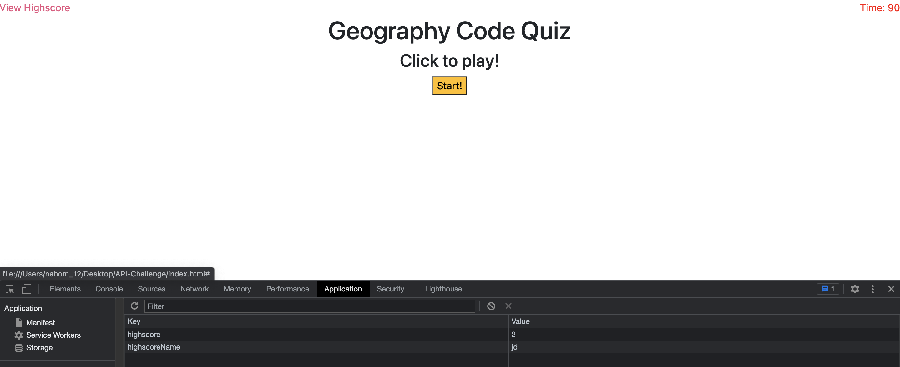

# API Challenge Starter Code

**Version 1.0.0**

## The Purpose
The purpose of this project was to create a quiz game where the user goes through a series of interactive trivia like questions in an allotted amount of time. Our job was to also store the high score and present the highscore.

## Significant Changes
This project required us to utilize many different aspects of what we learned so far in javascript. I became accustomed with Jquery typescript so you will see many of my DOM manipulation choices were in Jquery. The architecture I used was an array of objects that would get looped over in a for loop to compare the index at the array of options to the answer. This was the two central pieces needed to navigate the rest of the functions needed to complete the challenge.

### Challenges
There were significant challenges on this project that were as much theoretical as practical. What I mean is Javascript code was not given to us, and in terms of architecture there were a myriad of ways one could go about it. Further, I had issues with my for loop in regards to appending to the DOM so new questions would be presented after a answer selection was provided. There was a series of debugging that was required with the time function, and to the local storage as well. Console.log was crucial here in navigating what listeners were not working etc.

#### Screenshot

##### Link
https://nahom-assefa.github.io/API-Challenge/

###### License and Copyright
© Xander Rapstine, Trilogy Education Services/2U